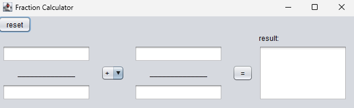
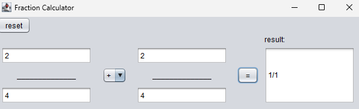
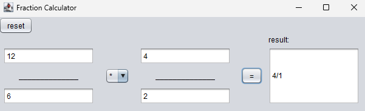

# Fraction Calculator GUI

## Features

This application provides a simple and intuitive interface for performing fractional calculations. It allows users to easily input fractions, select an arithmetic operation, and view the result.
The interface includes:

- Input fields for entering numbers
- A combobox to select the operation
- An "equals" (=) button to execute the operation
- And a textarea to display the result

## Functionality

The program workflow is straightforward:

- Enter the input values
- Select the arithmetic operation from the combobox
- Press the "=" button to process the input
- The program reads the inputs and operation, then uses a switch-case logic to determine the appropriate calculation
- The result is calculated, simplified and displayed in the textarea

## Screenshots

